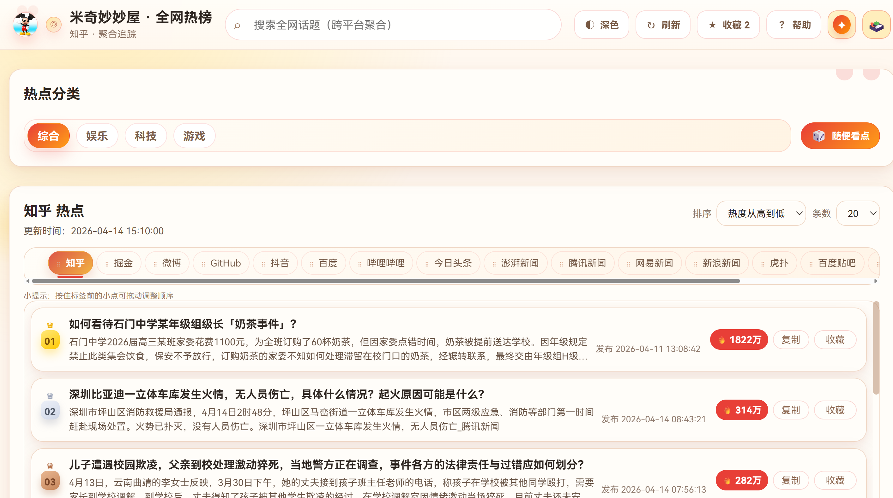

# 🔥 米奇妙妙屋·全网热榜 - MiQi Hot Trends

基于 [DailyHotApi](https://github.com/imsyy/DailyHotApi) 的热点聚合前端项目，使用 Vue 3 + Vite + CSS 组件化开发。  
内置 **50 个平台配置**，支持热点浏览、分类筛选、趣味功能与完整交互体验。



---

## 🎯 特性

- ✅ **多平台聚合**：微博、知乎、抖音、B 站、GitHub、贴吧、虎扑等
- ✅ **分类切换**：综合 / 娱乐 / 科技 / 游戏
- ✅ **完整交互**：收藏、复制、刷新、随机热点、加载更多
- ✅ **趣味模块**：米奇今天吃啥？、米奇今日运势
- ✅ **响应式布局**：桌面端与移动端均可良好浏览
- ✅ **主题统一**：米奇妙妙屋风格 UI，视觉精致、辨识度高

---

## 🚀 快速开始

### 1. 准备 DailyHotApi 服务

请先确保 DailyHotApi 可以访问，例如：

```bash
curl http://localhost:6688/weibo
```

返回正常 JSON 即表示后端可用。

### 2. 启动前端项目

```bash
# 进入项目目录
cd MiQi

# 安装依赖
npm install

# 复制环境变量模板（Windows 可手动复制）
cp .env.example .env

# 启动开发环境
npm run dev
```

### 3. 构建与预览

```bash
# 生产构建
npm run build

# 本地预览构建结果
npm run preview
```

---

## 🔌 DailyHotApi 相关内容（官方参考）

官方仓库地址：

- https://github.com/imsyy/DailyHotApi

官方项目定位：

- 今日热榜 API，聚合多平台热门数据
- 支持 JSON 模式与 RSS 模式
- 支持多种部署方式（手动、Docker、PM2、Vercel、Railway、Zeabur）

### 手动部署（推荐新手）

```bash
git clone https://github.com/imsyy/DailyHotApi.git
cd DailyHotApi
npm install
```

复制 .env.example 为 .env 并按需修改配置后，执行：

```bash
# 开发模式
npm run dev

# 编译运行
npm run build
npm run start
```

### Docker 部署

```bash
# 本地构建镜像
docker build -t dailyhot-api .

# 启动容器
docker run --restart always -p 6688:6688 -d dailyhot-api
```

或直接使用官方镜像：

```bash
docker pull imsyy/dailyhot-api:latest
docker run --restart always -p 6688:6688 -d imsyy/dailyhot-api:latest
```

### PM2 部署

```bash
npm i pm2 -g
sh ./deploy.sh
```

### 在线部署

- Vercel 一键部署（官方提供）
- Railway 一键部署（需先 fork）
- Zeabur 一键部署（需先 fork）

### 使用注意

- DailyHotApi 默认带缓存机制（官方文档说明默认约 60 分钟）
- 部分接口依赖页面抓取环境，部署时请确保运行环境完整
- 接口仅用于学习、研究和开发测试，具体请以官方免责声明为准

---

## 📊 功能清单

### 热榜能力

- 多平台热点聚合展示
- 分类筛选与平台切换
- 平台标签拖拽排序
- 搜索与关键词高亮
- 热度值和发布时间展示

### 交互能力

- 收藏/取消收藏
- 一键复制热点内容
- 刷新与失败重试
- 随机跳转热点（随便看点）
- 下拉刷新与分页加载

### 趣味功能

- **米奇今天吃啥？**：午饭随机推荐 + 条件筛选
- **米奇今日运势**：星座选择 + 运势解读 + 专属热点推荐

---

## 🧰 技术栈

| 分类 | 技术 |
|------|------|
| 前端框架 | Vue 3 |
| 构建工具 | Vite |
| 状态管理 | Pinia |
| 路由 | Vue Router |
| 请求库 | Axios |
| 工具库 | @vueuse/core |
| 列表优化 | vue-virtual-scroller |
| 拖拽排序 | vuedraggable |
| 样式方案 | CSS（主题变量 + 组件样式） |
| 语言 | TypeScript + Vue SFC |

---

## 📌 支持平台

> 项目内置 50 个平台配置，实际可用平台以 DailyHotApi 当前开放路由为准。

### 分类分布

| 分类 | 数量 | 示例平台 |
|------|------|----------|
| 综合 | 19 | 微博、知乎、抖音、百度、GitHub |
| 娱乐 | 9 | 豆瓣电影、B 站热搜、快手、小红书 |
| 科技 | 11 | IT 之家、虎嗅、CSDN、Hacker News |
| 游戏 | 11 | 英雄联盟、原神、Steam、NGA |

### 常用平台 API Key 示例

`weibo`、`zhihu`、`douyin`、`bilibili`、`github`、`juejin`、`baidu`、`hupu`、`tieba`、`36kr`

---

## 📖 使用示例

### 示例 1：本地开发

```bash
npm run dev
```

### 示例 2：生产构建

```bash
npm run build
```

### 示例 3：预览生产包

```bash
npm run preview
```

### 示例 4：切换接口地址

在页面底部点击 **切换接口地址**，输入新的 DailyHotApi 地址后即可生效。

---

## 🔧 配置

### 环境变量

| 变量名 | 默认值 | 说明 |
|--------|--------|------|
| `VITE_DAILY_HOT_API_BASE_URL` | `http://localhost:6688` | DailyHotApi 服务地址 |

`.env.example` 内容：

```env
VITE_DAILY_HOT_API_BASE_URL=http://localhost:6688
```

### 运行时配置

- 支持页面内动态切换接口地址
- 切换结果写入浏览器 LocalStorage

---

## 🏗️ 架构

```text
用户操作
  -> 视图组件 (views/components)
  -> Pinia 状态层 (stores/hot.ts)
  -> 服务层 (services/hotApi.ts)
  -> DailyHotApi
  -> 多平台热点数据源
```

### 核心模块说明

| 模块 | 说明 |
|------|------|
| `src/views/HomeView.vue` | 首页主视图，组织热榜与功能模块 |
| `src/stores/hot.ts` | 热榜状态管理、缓存、搜索、收藏逻辑 |
| `src/services/hotApi.ts` | 热点接口请求与数据标准化 |
| `src/components/business/` | 业务组件（列表、平台、午饭、运势） |
| `src/components/global/` | 全局组件（Header、Footer、状态反馈） |

---

## 📂 目录结构

```text
MiQi/
├─ public/                    # 静态资源（图标/图片/预览图）
├─ src/
│  ├─ assets/
│  ├─ components/
│  │  ├─ business/            # 热榜业务组件
│  │  └─ global/              # 全局通用组件
│  ├─ config/                 # 接口配置
│  ├─ constants/              # 平台与功能常量
│  ├─ router/                 # 路由定义
│  ├─ services/               # API 调用层
│  ├─ stores/                 # Pinia 状态管理
│  ├─ types/                  # 类型定义
│  ├─ utils/                  # 工具函数
│  ├─ views/                  # 页面组件
│  ├─ App.vue
│  ├─ main.ts
│  └─ style.css
├─ .env.example
├─ package.json
└─ README.md
```

---

## 🌈 项目特色与 UI 风格

- 主题：米奇妙妙屋风格（可爱精致、统一克制）
- 色彩：米奇红 + 米奇黄 + 奶油米白
- 视觉：统一圆角、柔和阴影、卡片层次分明
- 体验：动画反馈轻量，不喧宾夺主

---

## 🚢 部署说明

### 通用部署

1. 执行 `npm run build`
2. 部署 `dist` 目录到静态托管平台

### Vercel 部署建议

- Framework Preset: Vite
- Build Command: `npm run build`
- Output Directory: `dist`
- Environment Variables: 配置 `VITE_DAILY_HOT_API_BASE_URL`

---

## ❓ 常见问题

### Q1：页面没有数据怎么办？

请检查 DailyHotApi 是否可访问，以及 `.env` 中接口地址是否正确。

### Q2：搜索为什么有时结果较少？

当前为聚合检索能力，结果依赖后端返回数据，不等同于全文搜索引擎。

### Q3：移动端体验如何？

项目已适配移动端布局，支持基础操作与功能弹窗交互。

### Q4：如何快速定位业务逻辑？

建议从 `src/views/HomeView.vue` 和 `src/stores/hot.ts` 开始阅读。

---

## 🤝 贡献指南

欢迎提交 Issue / PR 来完善功能、修复问题或优化 UI 体验。

建议流程：

1. Fork 项目
2. 新建功能分支
3. 完成开发并自测
4. 提交 PR 并说明变更内容

---

## 📄 许可证

MIT License
